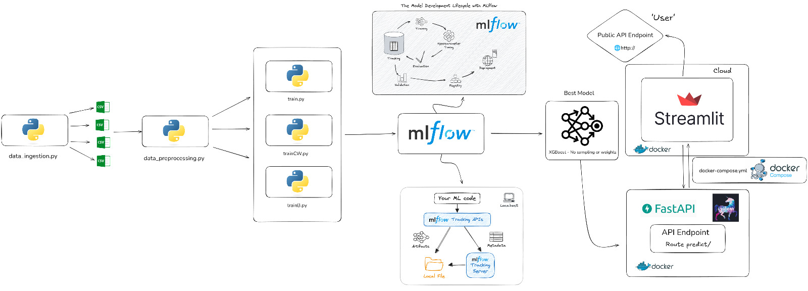
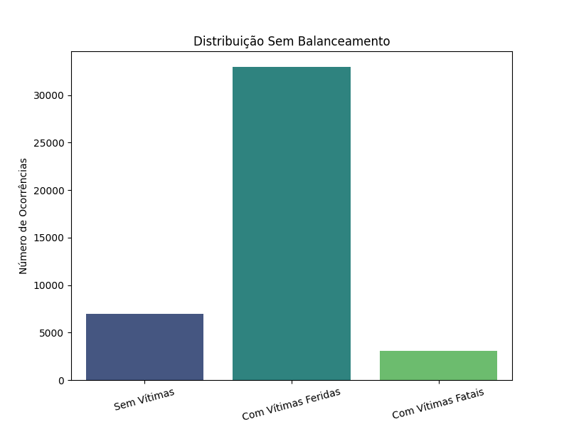
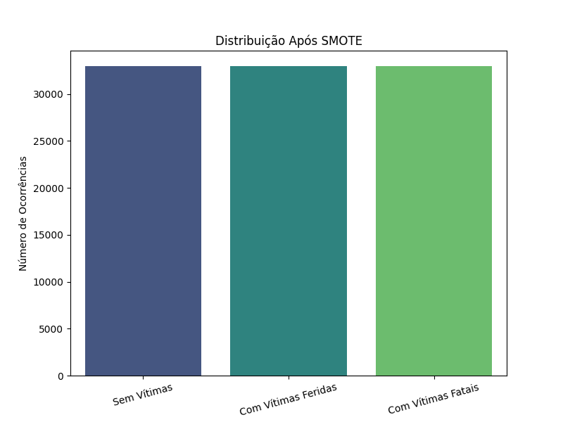
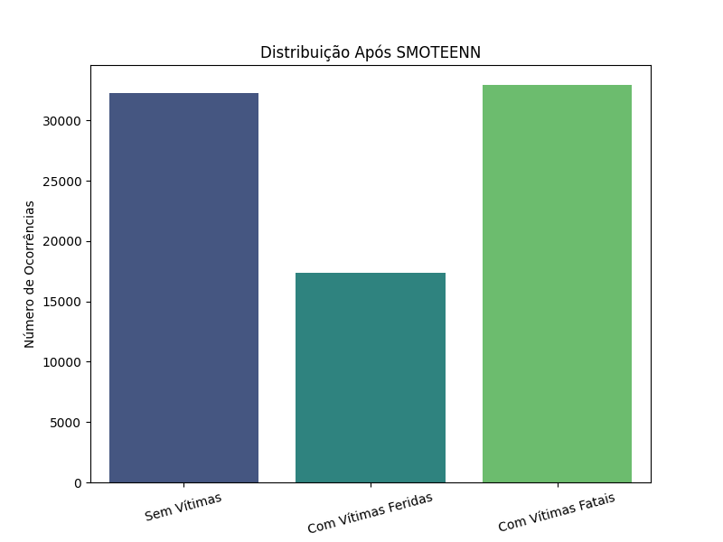
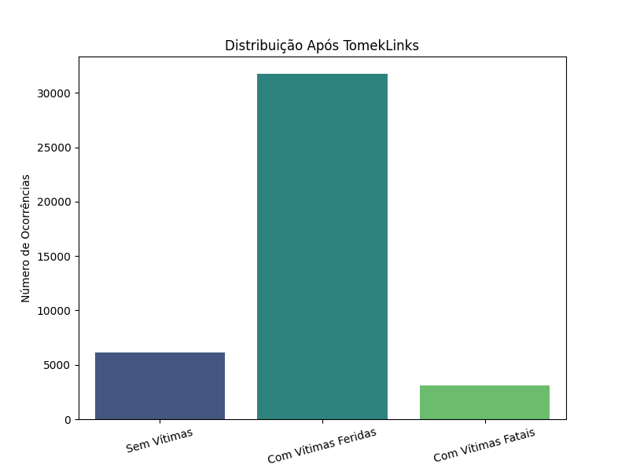
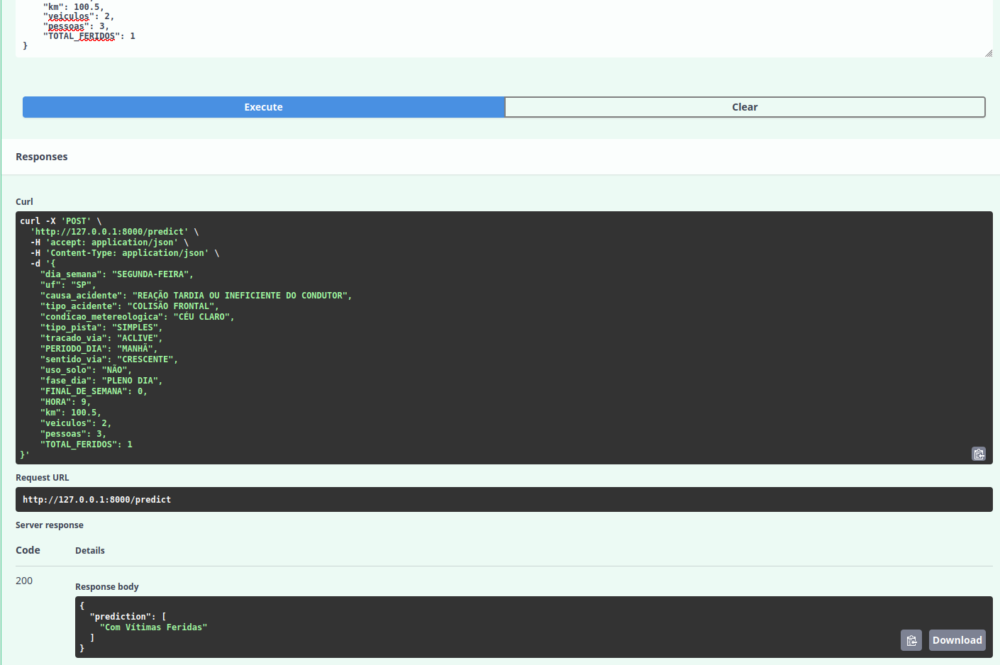
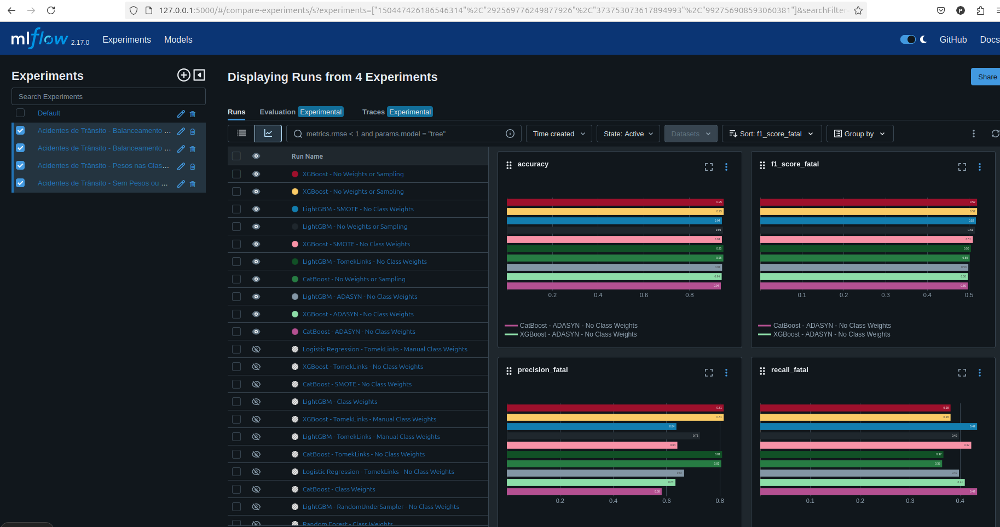

# Previsão de Gravidade de Acidentes de Trânsito nas Rodovias Federais do Brasil


## Introdução

Os acidentes de trânsito representam uma das principais causas de mortalidade global, configurando um sério problema de saúde pública. Em particular, os acidentes com vítimas fatais têm consequências devastadoras, não apenas para as famílias das vítimas, mas também para a sociedade como um todo, impactando sistemas de saúde, econômicos e sociais. 

A capacidade de prever se há vítima fatal numa ocorrência desses acidentes pode ser crucial para o desenvolvimento de políticas públicas eficazes e estratégias preventivas. Modelos preditivos podem auxiliar autoridades a identificar *fatores contribuintes*, permitindo a alocação direcionada de recursos e implementação de medidas preventivas que potencialmente salvam vidas.

## Motivação
Desenvolvido com o intuito de aprender e praticar habilidades em ciência de dados e machine learning, este projeto utiliza dados abertos da Polícia Rodoviária Federal (PRF) referentes às ocorrências de acidentes nas rodoviais federais do Brasil. A identificação precoce de fatores que contribuem para acidentes fatais pode auxiliar na tomada de decisões e implementação de medidas preventivas.

## Dados
A base de dados de acidentes da Polícia Rodoviária Federal (PRF) do Brasil é uma coleção abrangente de informações sobre acidentes ocorridos em rodovias federais. Esses dados são disponibilizados ao público em formato aberto, permitindo que pesquisadores, desenvolvedores e o público em geral possam acessar e utilizar as informações para diversos fins, desde a pesquisa acadêmica até o desenvolvimento de soluções para a segurança no trânsito.

Cada registro na base de dados corresponde a uma ocorrência de acidente e contém detalhes sobre o momento, local, condições do acidente, características dos veículos envolvidos, informações sobre as vítimas, etc.  As principais variáveis incluem:

- Características do acidente: tipo, causa, condições meteorológicas, etc.
- Informações geográficas: UF, município, km, etc.
- Gravidade do acidente: categorizada em 'Sem Vítimas', 'Com Vítimas Feridas' e 'Com Vítimas Fatais'.

## Estrutura do Projeto

```plaintext
.
├── data/
│   ├── raw/
│   └── processed/
├── artifacts/
│   └── preprocessor.pkl
├── src/
│   ├── data_ingestion.py
│   ├── data_preprocessing.py
│   ├── train.py
│   ├── trainB.py
│   ├── trainCW.py
│   ├── trainBCW.py
│   ├── train_utils.py
│   ├── app.py
│   └── app_streamlit.py
├── Dockerfile_fastapi
├── Dockerfile_streamlit
├── docker-compose.yml
├── columns.json
└── README.md
```

## Metodologia
O processo de desenvolvimento seguiu as etapas clássicas de um projeto de machine learning:

1. **Coleta e Ingestão de Dados**
O script `data_ingestion.py` automatiza o download e a obtenção do arquivo `datatran_2024.csv`. Idealmente, seria interessante baixar dados de vários anos e concatená-los para enriquecer o conjunto de dados. No entanto, devido a limitações computacionais, essa abordagem não foi implementada.

2. **Pré-processamento dos Dados**
O arquivo ``data_preprocessing.py`` realiza:

- Limpeza de dados: remoção de valores ausentes e duplicados.
- Conversão de tipos de dados e padronização de strings.
- Engenharia de Atributos: criação de novas variáveis como HORA, PERIODO_DIA, FINAL_DE_SEMANA e TOTAL_FERIDOS.
- Transformação de variáveis categóricas e numéricas usando OneHotEncoder e StandardScaler, respectivamente.
- Salvamento do pipeline de pré-processamento em preprocessor.pkl.
- Divisão dos dados em conjuntos de treino e teste.

- **Mapear gravidade dos acidentes para valores numéricos**: Poderíamos ter usado os métodos do scikit-learn mas criamos uma coluna 'GRAVIDADE' e mapeamos ``'SEM VÍTIMAS': 0``, ``'COM VÍTIMAS FERIDAS': 1``, ``'COM VÍTIMAS FATAIS': 2'``. Essa é a nossa *variável alvo*. 



3. **Treinamento dos Modelos**
Foram criados quatro scripts de treinamento, cada um aplicando diferentes abordagens para lidar com o desbalanceamento das classes e otimizar o desempenho do modelo na classe minoritária[2].

- 3.1 **train.py**: Treina os modelos sem aplicar técnicas de balanceamento ou pesos nas classes.
- Configura o MLflow para rastreamento dos experimentos
- Carrega os dados de treino e teste e o pré-processador.
- Define os modelos a serem treinados: RF, LR, XGBoost, LightGBM e CatBoost.
- Especifica grids de hiperparametros para cada modelo.
       

- 3.2 **trainB.py**: Aplica técnicas de balanceamento (under e oversampling) para lidar com o desbalanceamento das classes antes do treinamento.
- Definimos uma lista de tecnicas de balanceamento e aplicamos cada tecnica aos dados de treino usando a funcao ``apply_sampling``.
- E entao realiza-se o mesmo processo de treinamento e aval descrito em ``train.py``, mas agora com os dados balanceados.

- 3.3 **trainCW.py**: Aplica pesos às classes para enfatizar a classe minoritaria durante o treinamento sem alterar a distribuicao dos dados.
- Calculamos os pesos das classes utilizando ``compute_class_weight`` com a opcao ``balanced``.
- E configuramos os modelos para utlizar os pesos calculados. Para os modelos que suportam o  parâmetro ``class_weight``, como Random Forest e Logistic Regression, define class_weight com os valores calculados. Para modelos que não suportam ``class_weight`` diretamente com múltiplas classes (como XGBoost), utiliza ``sample_weight`` durante o treinamento.

- 3.4 **trainBCW.py**: Este script combina técnicas de balanceamento com a aplicação de pesos nas classes para potencialmente melhorar o desempenho na classe 'Com Vítimas Fatais'. No entanto, isso não aconteceu, possivelmente devido ao viés introduzido no modelo.
- Similar aos scripts anteriores, mas combina as abordagens de balanceamento e pesos nas classes.

## Modelos Utilizados

Aplicamos diversos algoritmos de aprendizado de máquina para prever a gravidade dos acidentes:

- **Regressão Logística**: Modelo estatístico simplificado para classificação que estima a probabilidade de ocorrência de uma classe com base nas variáveis independentes.
- **Random Forest**: Conjunto de árvores de decisão que melhora a precisão preditiva e controla o overfitting por meio de bagging e seleção aleatória de features.
- **XGBoost**: Algoritmo de boosting baseado em árvores de decisão que otimiza o desempenho através de técnicas de regularização e paralelização.
- **LightGBM**: Algoritmo de boosting que usa folhas em vez de níveis nas árvores de decisão, oferecendo maior velocidade e eficiência em grandes conjuntos de dados.
- **CatBoost**: Algoritmo de boosting que lida automaticamente com dados categóricos, reduzindo a necessidade de pré-processamento e mitigando overfitting.

## Técnicas de Balanceamento

Para lidar com o desbalanceamento das classes, foram utilizadas várias técnicas de amostragem:

- **ClusterCentroids**: Undersampling que reduz a classe majoritária substituindo grupos de instâncias por suas centroides.

- **NearMiss**: Undersampling que seleciona instâncias da classe majoritária mais próximas da classe minoritária.


- **ADASYN**: Oversampling adaptativo que gera novas instâncias sintéticas da classe minoritária com base em suas distribuições de densidade.


- **RandomUnderSampler**: Remove aleatoriamente instâncias da classe majoritária para balancear a proporção entre classes.


- **SMOTE**: Gera novas instâncias sintéticas da classe minoritária interpolando entre instâncias existentes.


- **SMOTEENN**: Combina SMOTE para oversampling da classe minoritária e Edited Nearest Neighbors para limpeza das instâncias ruidosas.


- **TomekLinks**: Remove pares de instâncias de classes opostas próximas entre si, ajudando a definir fronteiras mais claras entre as classes.



4. **Avaliação e Seleção do Modelo**
Após testar diferentes modelos e diferente técnicas de balanceamento aplicadas para cada um deles, o modelo com melhor desempenho na classe minoritária foi promovido para produção utilizando o MLflow ``register_promote_model.py``.

5. **Deploy do Modelo**
- **API**: Implementada com FastAPI no arquivo ``app.py``, disponibilizando o endpoint /predict para realizar previsões.
- **Interface We**: Desenvolvida com Streamlit no arquivo ``app_streamlit.py``, proporcionando uma interface amigável para inserção de dados e visualização das previsões.
- **Containerização**: Uso do Docker para containerizar a aplicação, facilitando a implantação em diferentes ambientes.

#### Arquivos Docker
- Dockerfile_fastapi: Configuração do container para a API FastAPI.

- Dockerfile_streamlit: Configuração do container para a interface Streamlit.

- docker-compose.yml: Orquestração dos containers para execução simultânea.

### Tecnologias Utilizadas
- **Linguagem**: Python
- **Frameworks e Bibliotecas**:
  - Pandas
  - NumPy
  - Scikit-learn
  - Imbalanced-learn
  - XGBoost
  - LightGBM
  - CatBoost
  - FastAPI
  - Streamlit
  - MLflow
- **Ferramentas de Implantação:**
  - Docker
  - Docker Compose

## Como executar o Projeto
1. Clone o Repositório:
```bash
git clone <URL_DO_REPOSITORIO>
cd <NOME_DO_REPOSITORIO>
```
2. Baixe e Pré-processe os Dados:

Execute os scripts de ingestão e pré-processamento:
```bash
python src/data_ingestion.py
python src/data_preprocessing.py
```
3. Treine o Modelo:
Escolha um dos scripts de treinamento e execute:
```bash
python src/train.py
```
Este script também registra o experimento no MLflow e salva os modelos treinados na pasta mlruns/. Depois de executar o arquivo ``train.py`` podemos acessar a interface do mlflow localmente digitando ``mlflow ui`` no terminal.


4. Inicie os Containers:
Utilize o Docker Compose para iniciar a API e a interface:
```bash
sudo docker-compose up -d --build
```
5. Acesse a Aplicação:

- API FastAPI: Disponível em http://localhost:8000.
- Interface Streamlit: Disponível em http://localhost:8501.

## Uso da Aplicação
- Interface Web: Acesse a interface Streamlit e preencha os campos solicitados com as características do acidente. Clique em **Obter Previsão** para ver o resultado.

-**API**: Entre no Swagger UI do FastAPI em ``http://localhost:8000/docs`` e faca uma requisicao POST com um JSON contendo as features necessarias.
Exemplo:
```bash
{
    "dia_semana": "SEGUNDA-FEIRA",
    "uf": "SP",
    "causa_acidente": "REAÇÃO TARDIA OU INEFICIENTE DO CONDUTOR",
    "tipo_acidente": "COLISÃO FRONTAL",
    "condicao_metereologica": "CÉU CLARO",
    "tipo_pista": "SIMPLES",
    "tracado_via": "ACLIVE",
    "PERIODO_DIA": "MANHÃ",
    "sentido_via": "CRESCENTE",
    "uso_solo": "NÃO",
    "fase_dia": "PLENO DIA",
    "FINAL_DE_SEMANA": 0,
    "HORA": 9,
    "km": 100.5,
    "veiculos": 2,
    "pessoas": 3,
    "TOTAL_FERIDOS": 1
}
```


## Resultados

O critério de comparação principal foi o F1-score para a classe "com vítima fatal", que reflete o equilíbrio entre precisão e recall para identificar acidentes fatais. Os principais resultados foram:
- **XGBoost (Sem Pesos ou Amostragem):** Apresentou o melhor F1-score para a classe de interesse, alcançando valores próximos a 0.52 nos melhores casos. Este resultado sugere que o modelo XGBoost, mesmo sem técnicas de balanceamento, consegue melhor capturar os padrões de acidentes fatais.

- **LightGBM com SMOTE e Tomek Links (Sem Pesos):** Este modelo também teve um desempenho competitivo, com F1-scores próximos a 0.51. A combinação de SMOTE e Tomek Links pareceu favorecer o LightGBM na detecção de vítimas fatais, indicando que estas técnicas podem ajudar na redução do impacto de amostras ruidosas e no balanceamento da classe minoritária.

- **CatBoost (Sem Pesos ou Amostragem):** Apesar de seu desempenho inferior ao XGBoost e LightGBM, o CatBoost obteve valores de F1-score em torno de 0.50, o que ainda representa uma performance razoável. A ausência de pesos ou técnicas de amostragem sugere que o CatBoost também possui uma certa robustez frente ao desbalanceamento.

- **Regressão Logística com Tomek Links e Pesos Manuais:** Embora a Regressão Logística não tenha sido tão eficaz quanto os modelos Ensembles de gradient boosting, o uso de Tomek Links e o ajuste manual de pesos nas classes ajudaram a alcançar F1-scores próximos a 0.49, o que indica uma melhora em relação à versão sem balanceamento.

### Análise dos Resultados:
#### Trade-Off entre Classes
As técnicas de balanceamento e otimização impactam diretamente no equilíbrio entre Precisão e Recall, criando um trade-off que precisa ser cuidadosamente gerenciado:
- **Precisão:** Alta Precisão indica que poucas instâncias preditas como 'Com Vítimas Fatais' são falsas positivas. No entanto, focar excessivamente na Precisão pode resultar em baixo Recall, ou seja, o modelo deixa de identificar muitos casos reais dessa classe.
- **Recall:** Alto Recall significa que o modelo consegue identificar a maioria das instâncias reais de 'Com Vítimas Fatais'. Contudo, isso geralmente acarreta em baixa Precisão, aumentando o número de falsos positivos.

A aplicação de Class Weights inicialmente aumentou o Recall para todas as classes, mas resultou em variações bruscas na Precisão. A introdução de SMOTE e TomekLinks melhorou a Precisão e moderadamente a Recall para alguns modelos, enquanto outras tecnicas ofereceram um equilíbrio entre ambas as métricas. A otimização com GridSearchCV permitiu ajustar os hiperparâmetros para maximizar o F1-Score, que é uma métrica que combina Precisão e Recall, oferecendo uma visão mais equilibrada do desempenho do modelo.

- **Melhoria no F1-Score**: Observamos que a combinação de *XGBoost - No Weights or Sampling* atingiu o melhor f1-score para a classe 'Com Vítimas Fatais' (0.5189),  sugerindo que este algoritmo é bem adaptado para o problema, mesmo com desbalanceamento. Entretanto, as técnicas de amostragem (como SMOTE e Tomek Links) apresentaram vantagens especialmente para o LightGBM, que obteve desempenhos competitivos. Esses achados indicam que o uso de técnicas de balanceamento pode ser benéfico dependendo do modelo escolhido, mas que, para o XGBoost, as técnicas de balanceamento adicionais podem ser dispensáveis para este conjunto de dados.

- **Impacto das Técnicas de Balanceamento**: O uso de tecnicas undersampling como ``ClusterCentroids``, ``NearMiss`` e ``RandomUnderSampler`` aumentou o recall dos modelos a custo da precisao e uma f1-score baixa, como era de se esperar. Refletindo o trade-off entre identificar mais casos positivos e evitar falsos positivos.

- **Otimização de Hiperparâmetros:** O GridSearchCV contribuiu para melhorias adicionais nos modelos, embora o ganho não tenha sido tão expressivo.

## Visualizações

Para facilitar a compreensão dos resultados, aqui esta um exemplo da interface no mlflow ``mlflow ui``. Podemos visualizar as metricas em formato de grafico de barras e ordena-los em ordem decrescente.



*A imagem ilustram diferentes tecnicas aplicadas a diferentes modelos, ordenados pela metrica f1-score da classe 'Com vitimas fatais'*

## Conclusão

As técnicas de balanceamento aplicadas a diferentes tipos de modelos tiveram efeitos significativos nas métricas de desempenho para a classe 'Com Vítimas Fatais'.

Este trade-off entre Precisão e Recall é intrínseco ao lidar com classes desbalanceadas. A escolha da técnica de balanceamento e a otimização dos parâmetros do modelo devem ser guiadas pelos objetivos específicos do projeto. No nosso contexto de previsão de acidentes fatais, acredito que priorizar o Recall pode ser mais adequado para garantir que a maioria dos casos críticos sejam identificados, mesmo que isso implique em um aumento no número de falsos positivos.

## Melhorias Futuras
**Expansão do Dataset**: Incluir dados de anos anteriores para enriquecer o conjunto de dados.
**Exploração de Novos Modelos**: Testar outras técnicas de balanceamento e algoritmos, como SVM e Redes Neurais.
**Otimização de Hiperparâmetros**: Refinar ainda mais os modelos para melhorar as métricas.
**Monitoramento em Produção**: Implementar ferramentas para monitorar o desempenho do modelo após o deploy.

## Contribuição

Contribuições serão muito bem-vindas! Sinta-se à vontade para abrir issues e pull requests.

## Contato

##### Pedro Henrique Arias Oliveira: 
<p align="center"> 
  <a href="https://www.linkedin.com/in/pedroarias92/" target="blank">
    
  </a> 
  <a href="mailto:pedro.oliveira@sistemafiep.org.br" target="blank">
    
  </a>
</p>
